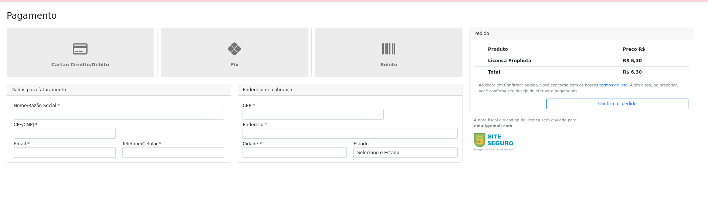

[](https://heroku.com/deploy/?template=https://github.com/gilberto-009199/assas-php)

# Integração com Assas  

> ATENÇÃO, essa aplicação e Legada e Não tem quqlquer proteção basica.
>




Exemplo de integração com o **assas** para gerar link de pagamento. Usando **PHP**, **Docker**, **JQuery** e **Bootstrap**.


## How Run

```shell
$ docker compose up
```
